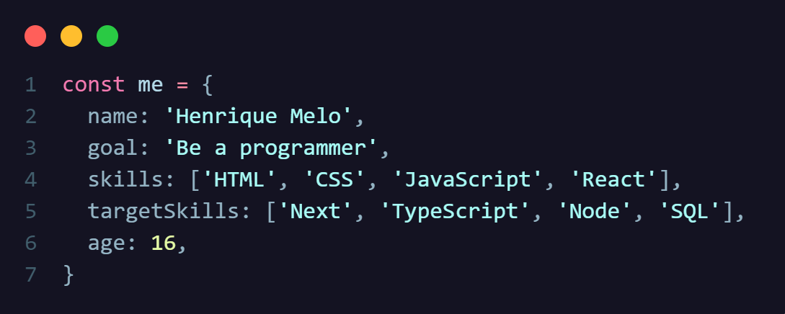

# Oi! Eu sou o Henrique Melo 

  
Tenho 16 anos e moro em Maceió-AL. Sonho em trabalhar como programador, amo esta profissão. Estou estudando principalmente React, e tenho como objetivo me aprofundar em NextJS no âmbito do front-end. Em breve iniciarei meus estudos em Node, para ser capaz de construir aplicações completas. Meu GitHub conta com projetos feitos com intuitos didáticos!

  <a href="https://github.com/HenriqueMelo2007">
  
  

 
  
  
  
  

##

  
  

##

